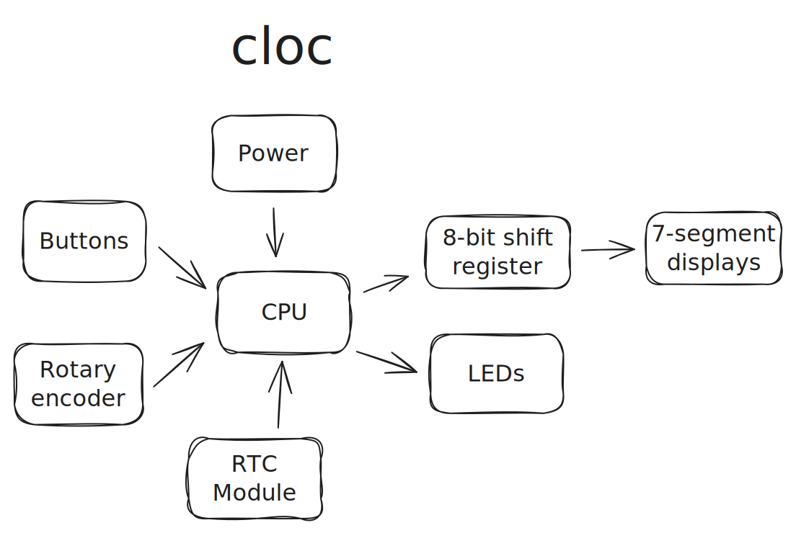

# cloc

Simple RP Pico-powered clock.



## Rust project

### Required Tools

#### `probe-rs`

Used for flashing the board and debugging. Follow the [official installation guide.](https://probe.rs/docs/getting-started/installation)

Make sure to follow the **Prerequisites** section for your OS.

#### `probe-rs-debugger`

Used for VSCode debugging. See [lib.rs](https://lib.rs/crates/probe-rs-debugger) for more info.

```bash
cargo install probe-rs-debugger
```

### Running the code


```bash
cargo run --release --bin <file_name>
```
